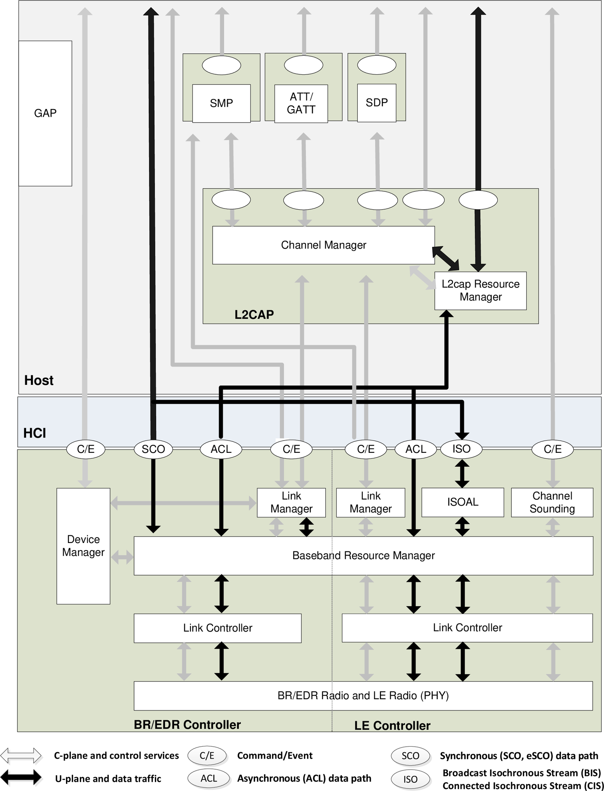
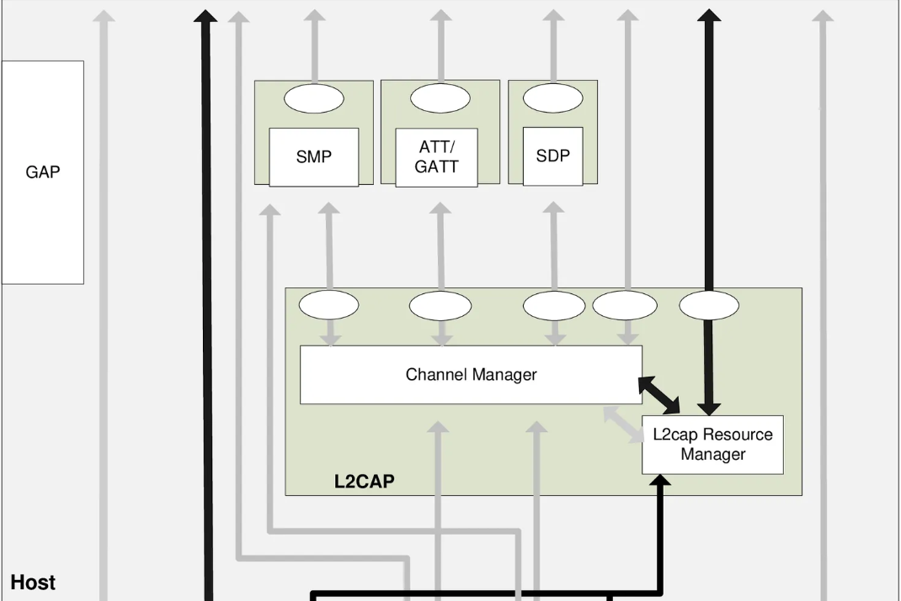
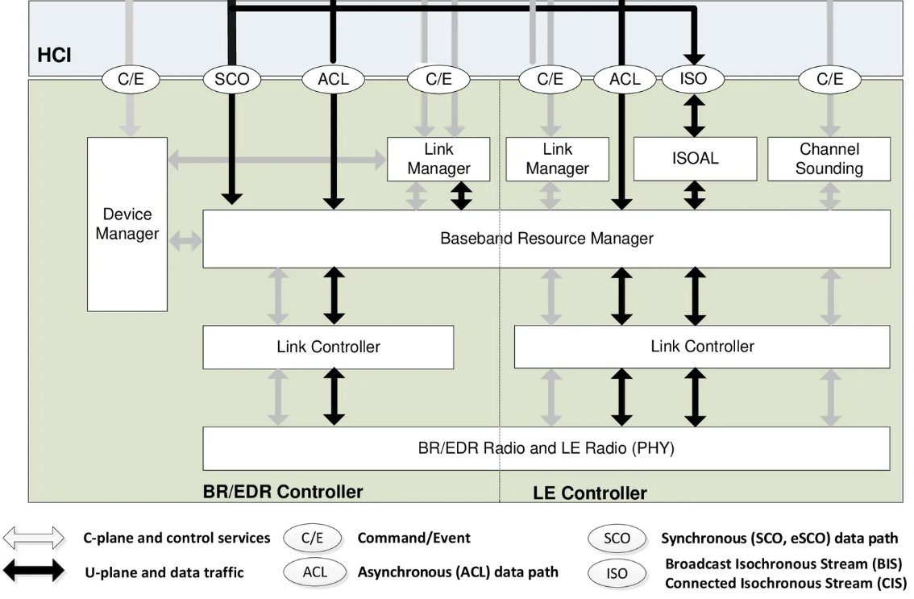

# 主机层（host）
处理高层协议和业务逻辑。
* L2CAP (逻辑链路控制与适配协议): 处理数据分段、重组和复用。
  *  Channel Manager（信道管理器）： 创建 / 删除信道、分配 CID（信道 ID）、路由数据到对应上层协议  
  *  L2cap Resource Manager（L2cap 资源管理器）： 负责资源调度与 QoS：为不同逻辑信道分配带宽、优先级，避免某一业务独占链路  
* GAP (通用访问规范): 管理设备发现、连接建立，并定义蓝牙设备的角色和模式。
* SMP (安全管理协议): 管理身份验证、加密和安全配对。
* ATT/GATT (属性协议/通用属性规范): 通过服务和特征实现基于属性的数据交换，主要用于低功耗蓝牙。
* SDP (服务发现协议): 允许设备广播和发现可用服务，主要用于经典蓝牙。

# 主机控制器接口（HCI）

Host与控制器之间的通信接口。

## C/E
命令 / 事件，是 Host（主机）与 Controller（控制器）之间的控制交互：
例如：
* Host 发送 Command（如 “发起连接”“设置功率”）给 Controller；
* Controller 回复 Event（如 “连接完成”“状态变化”）给 Host。
## ACL
Asynchronous Connectionless：异步无连接链路
特点：
* 面向非实时、突发数据（如文件传输、网络共享、BLE 设备的传感器数据）；
* 不保证固定时延，靠重传保证可靠性；
* 是经典蓝牙（BR/EDR）和 BLE 都支持的基础数据通道。
* 典型场景：手机传文件、BLE 温湿度传感器上报数据、蓝牙网络共享。
## SCO/eSCO
Synchronous Connection-Oriented：同步面向连接链路（含增强版 eSCO）  
特点：
* 专为实时语音设计，保证固定时延和带宽（类似 “专线”）；
* 少量丢包不重传，优先保证时序（语音可容忍轻微丢包）；
* 仅经典蓝牙（BR/EDR）使用，BLE 无 SCO。
* 典型场景：蓝牙耳机通话、车载免提电话。
## ISO
Isochronous Stream：等时同步流，分两类：
* BIS = Broadcast Isochronous Stream：广播等时流（一对多广播，如多设备同步音频）；
* CIS = Connected Isochronous Stream：连接等时流（一对一 / 一对多连接，如 LE Audio 耳机）。
特点：
* BLE 引入的低功耗实时音频 / 视频通道，替代传统 SCO；
* 兼顾低时延与低功耗，支持多设备同步、广播音频；
* 是 LE Audio（蓝牙低功耗音频）的底层基础。
* 典型场景：LE Audio 蓝牙耳机、蓝牙广播音箱、同步音频广播。

分为经典蓝牙BR/EDR Controller和低功耗蓝牙LE Controller
**管理无线资源、调度链路、控制射频收发** ，是蓝牙协议栈的 “底层执行引擎”，解决 “如何稳定、高效、公平地使用无线信道” 的问题。  
整个Controller就像是操作系统，把硬件和软件隔离开来，软件向它发送请求，它负责分配硬件。
* Device Manager 管 “整机状态”；
* Baseband Resource Manager 是 “核心调度器”，管无线资源；
* ISOAL/Channel Sounding 是 “专用业务子系统”，为 LE 新场景服务。
* Link Manager 管 “连接会话”；
* Link Controller + PHY 是 “驱动 + 硬件”；
